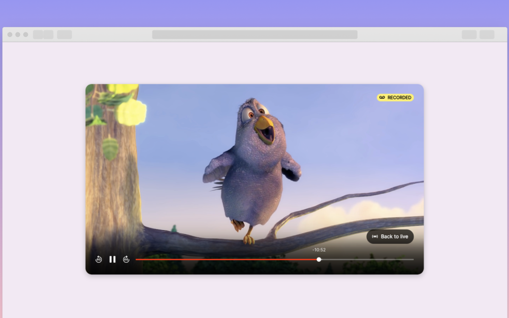
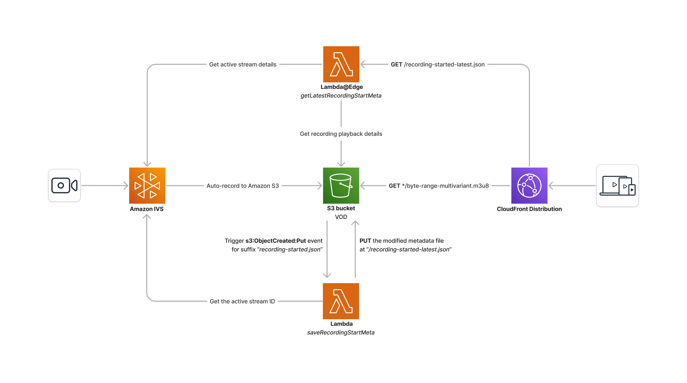

# Amazon IVS DVR web demo

A demo web application intended as an educational tool for demonstrating how you can implement a Live to VOD (DVR) experience using [Amazon IVS](https://aws.amazon.com/ivs/) and the auto-record-to-s3 feature using [Amazon S3](https://aws.amazon.com/s3/). The VOD content is served with [Amazon CloudFront](https://aws.amazon.com/cloudfront/) and [Amazon Lambda@Edge](https://aws.amazon.com/lambda/edge/).

This demo also uses [AWS Cloud Development Kit](https://aws.amazon.com/cdk/) (AWS CDK v2).



**This project is intended for education purposes only and not for production usage.**

## Prerequisites

- AWS CLI ([Installing the AWS CLI version 2](https://docs.aws.amazon.com/cli/latest/userguide/install-cliv2.html))
- NodeJS ([Installing Node.js](https://nodejs.org/))

## To use and deploy this project

**IMPORTANT NOTE:** this demo will create and use AWS resources on your AWS account, which will cost money.

Deploying the CDK stack will:

- create an Amazon IVS channel
- set up auto-record-to-S3 for that channel
- create Lambda and Lambda@Edge resources to process VOD content
- create a CloudFront distribution to serve the VOD content

### Architecture


<br>

### Configuration

The `cdk/config.json` file provides two configurable options:

- `channelType` can be set to `BASIC`, `STANDARD`, `ADVANCED_SD`, or `ADVANCED_HD`
- `allowedOrigins` is a list of origins (domain names) that CloudFront uses as the value for the `Access-Control-Allow-Origin` HTTP response header. You can add your custom domain to this list, or specify `['*']` to allow all origins.
- `insecureRTMPIngest` is a boolean flag that, when set to true, allows the channel to accept RTMP streams without requiring a secure connection.
- `transcodePreset` can only be set for `ADVANCED_HD` and `ADVANCED_SD` channel types, with allowed values `HIGHER_BANDWIDTH_DELIVERY` and `CONSTRAINED_BANDWIDTH_DELIVERY`. For `BASIC` and `STANDARD` channel types, preset should be an empty string (`""`).

By default, the demo will expect you to deploy the backend prior to running the frontend application, which will create a `cdk_output.json` file containing the CloudFront distribution domain name outputted from the deployment. However, if you wish to run your frontend against a different DVR demo backend, this behavior can be overridden by setting the following environment variable:

```shell
REACT_APP_DISTRIBUTION_DOMAIN_NAME=<domain-name>
```

Where `<domain-name>` is the domain name of the CloudFront distribution, such as `d111111abcdef8.cloudfront.net`. If you have chosen to set this environment variable, you may proceed straight to step 2 in the _Deployment_ section below.

**NOTE:** You can add or modify the allowed origins for CORS requests by modifying the ResponseHeaders policy through the CloudFront console, however this is not advisable and we recommend you make such changes by re-deploying the CDK stack with your changes in the `allowedOrigins` list in the `config.json` file.

### Deployment

1. To set up the backend, in the `cdk` directory, run:

   ```shell
   make app
   ```

   **NOTE:** this demo uses [AWS Lambda@Edge](https://aws.amazon.com/lambda/edge/), which is currently only available in the US East, N. Virginia (us-east-1) region. To comply with this requirement, this demo is configured to deploy to the us-east-1 region of the account specified in your AWS CLI profile.

   _In the `cdk` directory, run `make help` to see a list of available targets and other configuration options._

   The script will give you 2 important pieces of information:

   - `DVRdemoStack.ingestServer`, the ingest server address to use in your broadcasting software ([learn how to stream to Amazon IVS](https://aws.amazon.com/blogs/media/setting-up-for-streaming-with-amazon-ivs/))
   - `DVRdemoStack.streamKey`, the stream key for your newly created Amazon IVS channel  
     <br/>

   At this point, you may configure your broadcasting software and begin streaming before moving on to the next step.

2. Go to the `web-ui` directory and run the following commands to start the React frontend host:

   ```shell
   npm install
   npm start
   ```

   Once you go live, you will be able to see your live video stream on the hosted frontend. About 50 seconds since you started broadcasting, the VOD will become available and you will be able to seamlessly scrub between Live and VOD in the player.

## Backend Specification

```
GET https://<distribution-domain-name>/recording-started-latest.json
```

Response Schema:

```ts
{
  isChannelLive: boolean,
  livePlaybackUrl?: string,
  masterKey?: string,
  playlistDuration: number | null,
  recordingStartedAt?: string,
}
```

- `isChannelLive` is an indicator of the current status of the IVS channel
- `livePlaybackUrl` is the playback URL for the livestream.
- `masterKey` is the S3 key path for the `byte-range-multivariant.m3u8` file of the VOD playback
- `playlistDuration` is the duration of the latest VOD playlist (used only on iOS mobile browsers)
- `recordingStartedAt` is the date time that the stream recording started at, in ISO 8601 format

The response object returned by this endpoint will only contain the relevant properties based on the current state of the channel.

## Backend Teardown

To avoid unexpected charges to your account, be sure to destroy your CDK stack when you are finished:

1. If you are currently streaming, stop the stream

2. In the `cdk` directory, run:

   ```shell
   make destroy
   ```

After running this command, you will notice that the stack deletion process will fail. This is expected, as only the _associations_ between the Lambda@Edge functions and the CloudFront distribution are removed.

The remaining Lambda@Edge function replicas will typically be automatically deleted by CloudFront within a few hours, at which point you will be able to run `make destroy` once again to complete deleting the stack, along with the Lambda functions that failed to delete from earlier.

Alternatively, you may choose to manually delete the CloudFormation stack from the AWS console while retaining the Lambda@Edge functions for you to delete at a later time, allowing you to immediately re-deploy the stack if needed.

## Limitations and Known Issues

- Full functionality for iOS mobile browsers is limited due to player-related constraints. As a consequence, on iOS devices only, the user _may not_ be able to seek within the last 30 seconds of the VOD content.
- This demo uses Lambda@Edge, which is currently only supported in the us-east-1 (N.Virginia) region.

## About Amazon IVS

Amazon Interactive Video Service (Amazon IVS) is a managed live streaming solution that is quick and easy to set up, and ideal for creating interactive video experiences. [Learn more](https://aws.amazon.com/ivs/).

- [Amazon IVS docs](https://docs.aws.amazon.com/ivs/)
- [User Guide](https://docs.aws.amazon.com/ivs/latest/userguide/)
- [API Reference](https://docs.aws.amazon.com/ivs/latest/APIReference/)
- [Setting Up for Streaming with Amazon Interactive Video Service](https://aws.amazon.com/blogs/media/setting-up-for-streaming-with-amazon-ivs/)
- [Learn more about Amazon IVS on IVS.rocks](https://ivs.rocks/)
- [View more demos like this](https://ivs.rocks/examples)

## Security

See [CONTRIBUTING](CONTRIBUTING.md#security-issue-notifications) for more information.

## License

This library is licensed under the MIT-0 License. See the LICENSE file.
