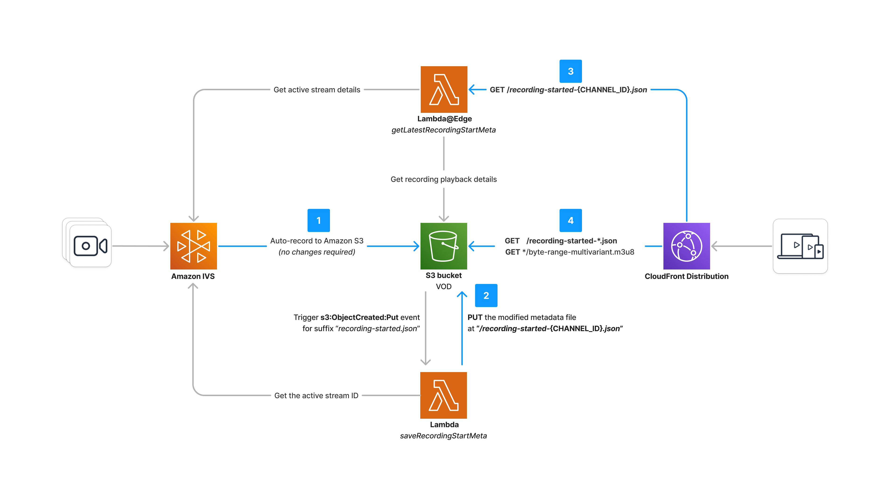

# Multi-channel Live-to-VOD

The current Live-to-VOD (DVR) demo has been designed to support a single Amazon IVS channel. However, with some modifications to the infrastructure, it is possible to expand the functionality to support multiple Amazon IVS channels while keeping most of the existing functional components intact.

This guide does not make any assumptions for how the multiple Amazon IVS channels are created and configured; this implementation detail is left to the reader. Instead, this guide is an overview of the necessary changes to adapt the Live-to-VOD system for multi-channel support.

**1. Recording Configuration and Amazon S3 Bucket Structure**

- The existing recording configuration can be utilized to save recordings from multiple Amazon IVS channels to the same Amazon S3 bucket.
- Amazon IVS automatically creates a dedicated path within the S3 bucket for each channel, ensuring that recordings from different channels are stored separately.

**2. Modifications to the `SaveRecordingStartMeta` Lambda Function**

- The `SaveRecordingStartMeta` Lambda function currently modifies and saves the latest `recording-started.json` file for a single Amazon IVS channel.
- To support multiple channels, the function needs to be modified to handle recording start metadata from all the configured channels.
- When a live stream starts for any of the channels, an `ObjectCreated` S3 event notification will be triggered, invoking the `SaveRecordingStartMeta` Lambda function for each of the channels that went live.
- The Lambda function should save the recording metadata for each channel separately, using appropriate naming conventions to distinguish between the files for different channels. For instance, you may adopt the naming convention of appending the channel ID to the end of the file name (i.e. `recording-started-{CHANNEL_ID}.json`).

**3. Modifications to the `GetLatestRecordingStartMeta` Lambda@Edge Function**

- The `GetLatestRecordingStartMeta` Lambda@Edge function currently returns the recording metadata for the single Amazon IVS channel in use.
- To accommodate multiple channels, the function should be updated to accept a parameter specifying the desired channel (i.e. the channel ID), rather than using the `channel-arn` custom header to identify the channel.
- Based on the provided channel parameter, the function should retrieve and return the recording metadata specific to that particular channel. For instance, following the channel ID naming convention from step 2, we can build the respective channel ARN and use it to retrieve metadata about the active session.

**4. CloudFront Distribution and Behavior Patterns**

- The existing CloudFront distribution can be used to support multiple Amazon IVS channels without requiring separate distributions for each channel.
- However, the current `/recording-started-latest.json` behavior pattern may need to be adjusted to handle the saved metadata file names for each channel.
- The behavior pattern should be modified to match the naming convention used for the metadata files of each channel, ensuring that the correct file is served based on the requested channel. For instance, following the channel ID naming convention from step 2, the behavior pattern would need to be changed to `/recording-started-*.json`

 

